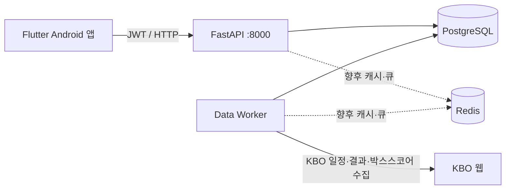

# MY9 현행 로직 및 기능 설명서

> 기준 버전: Android `0.1.0+1` / API `0.1.0`
> 작성 기준일: 2026-07-26
> 구성: Flutter 앱 + FastAPI API + APScheduler 데이터 워커 + PostgreSQL + Redis

## 1. 시스템 구성



- `mobile-app`: 사용자 화면, 인증 토큰 보관, API 호출, 구단 테마 렌더링
- `api-server`: 인증, 경기/구단/직관/리그/선수 기록/WPA 조회 API
- `data-worker`: KBO 일정·실시간 상태·박스스코어 수집과 시즌 지표 재집계
- `postgres`: 서비스 원본 및 집계 데이터 저장
- `redis`: Docker 구성에 포함되어 있으나 현행 핵심 수집 경로는 PostgreSQL을 직접 사용

## 2. 모바일 앱 기능

### 인증

- 회원가입: 아이디, 비밀번호, 닉네임, 응원팀 선택
- 로그인: 아이디/비밀번호 기반 JWT 인증
- 내 정보: 응원팀 변경
- API 연결 실패와 인증 오류를 한국어 메시지로 표시

### 홈

- 응원팀의 시즌 순위, 승·패·무, 승률 표시
- 최근 완료 경기 5개를 한 줄에 유지하고 다음 경기 표시
- 경기 일정, 직관 기록, 시즌 기록, WPA 분석, 팀 순위, 직관 리그 진입
- 응원팀에 따라 4개 메인 섹션 아이콘 변경
- 두산은 기본 아이콘 세트와 반달곰 아이콘 세트를 토글하여 한 번에 4종 변경

### 경기 일정과 경기 기록

- 월별 달력과 날짜별 경기 목록
- 달력의 승/무/패를 색상과 배지로 구분
- 경기 상세에서 팀별 타자/투수 기록 확인
- 한 타순에서 선수가 교체된 흐름을 카드로 표시
- KBO 복합 포지션은 `중우` 대신 `중견수 → 우익수`처럼 이동 방향으로 표시
- 결승타와 끝내기 홈런이 확인된 선수는 경기 기록에 표시

### 나의 직관 기록

- 관람 경기, 응원팀 또는 중립 관람, 좌석 정보, 메모 저장
- 별점 입력 및 표시는 제거됨
- 전체 직관 승·무·패와 승률
- 요일별·구장별 승률
- 직관 경기 범위에서 타자 TOP 3:
  - OPS
  - 출루율
  - 장타율
  - 안타
  - 도루
- 직관 경기 범위에서 투수 TOP 3:
  - 기본 탭: 투구 이닝, 승수, ERA
  - 탈삼진/K9
  - 피안타율
- 결승타 선수 순위와 직관 경기별 결승타 조회

### 시즌 선수 기록

- 타자: 타율, 출루율, 장타율, OPS, 안타, 홈런, 타점, 볼넷, 삼진, 도루,
  추정 wOBA/wRC/wRC+, WPA
- 투수: 경기, 이닝, 피안타, 피홈런, 타자 상대 수, 실점/자책, 볼넷, 탈삼진,
  투구 수, ERA, WHIP, K/9, BB/9, K/BB, FIP, K-BB%, WPA
- 선택한 정렬 기준의 실제 값이 리스트 우측 핵심 값으로 렌더링됨
- 선수 상세는 지표 그룹별 2열 카드로 표시

### 구단 순위

- 시즌 순위, 경기 수, 승·무·패, 승률
- 구단 행 선택 시 하단 시트에 팀 타율, 안타, 홈런, ERA, WHIP, 탈삼진 표시

### WPA

- 경기별 이벤트 WPA 및 선수별 경기 WPA 조회 화면
- 시즌 타자/투수 기록과 시즌 WPA 순위에서 집계 WPA 표시
- 현재 DB 모델, API 조회, KBO 이벤트 어댑터 인터페이스는 준비되어 있음
- 주의: KBO의 과거 경기 페이지가 표준 이벤트 상태값을 제공하지 않는 경우
  `game_events → wpa_events → player_game_wpa` 생성은 수행할 수 없다. 현재 워커는
  데이터가 없는 상태에서 임의 이벤트를 만들지 않으며, 이 경우 WPA 화면은 빈 상태로 남는다.

### 직관 리그

- 리그 생성
- 초대 코드로 참가
- 리그 상세와 멤버 확인

## 3. 디자인 및 반응형 규칙

- 전체 콘셉트: 밝은 야구장, 입장권, 전광판, 관중석 블록, 베이스와 다이아몬드
- 색상: 크림 배경, 민트/코랄/버터 포인트, 짙은 네이비 본문
- 폰트: 제목 `Jua`, 본문 `Gowun Dodum`
- 공통 배경 `StadiumAppShell`:
  - 화면 최대 콘텐츠 폭 760px
  - 태블릿에서는 콘텐츠를 가운데 정렬
  - 시스템 글자 배율을 0.9~1.22 범위로 제한해 극단적 레이아웃 파손 방지
- 320px 폭에서는 카드 내부 여백과 아이콘 영역을 축소
- 긴 값은 `Expanded`, 줄바꿈, 스크롤, 카드 그리드를 사용해 오버플로 방지
- 검증 해상도:
  - 320×568
  - 360×800
  - 390×844
  - 430×932
  - 600×960
  - 글자 배율 1.25 포함

## 4. 데이터 수집 로직

### 워커 시작 시

1. DB의 `season_backfill:{연도}` 성공 이력과 미완료 경기의 가장 이른 날짜를 조회
2. 최초 실행이면 3월 1일부터, 전체 백필 성공 이후면 최근 30일부터 일정 조회
3. 과거에 멈춘 경기나 미확정 박스스코어가 있으면 최근 30일보다 이른 날짜에서도 재개
4. 일정은 날짜·홈팀·원정팀·경기시간을 기준으로 기존 행을 찾아 갱신
5. 외부 경기 ID 충돌 시에도 `ON CONFLICT`로 갱신
6. 오늘 이전 완료 경기 중 `boxscore_finalized_at IS NULL`인 경기의 박스스코어 수집
7. 타자/투수 경기 기록 upsert 후 시즌 집계 재생성
8. 오늘 일정과 전일 박스스코어를 한 번 더 확인

최초 전체 작업 중 한 날짜라도 실패하면 성공 이력을 남기지 않으므로 다음 시작 때 시즌 전체를 다시
보정한다. 전체 성공 이후에는 최근 30일과 DB에서 확인된 가장 이른 미완료 날짜를 기준으로 재개한다.
취소 경기는 정상적으로 박스스코어 대상에서 제외한다.

### 정기 작업

| 주기 | 작업 | 대상 |
|---|---|---|
| 매시 00/30분 | 오늘 일정 갱신 | 오늘 |
| 매시 05/35분 | 최근 결과 보정 | 오늘 포함 최근 4일 |
| 10분마다 | 시작 경기 박스스코어 | `in_progress`, 미완료 `completed`만 |
| 10초마다 | 실시간 점수/상태 | 경기 30분 전부터 종료 예상 6시간까지 |
| 매일 00:00 | 전일 완료 경기 박스스코어 | 어제 |
| 컨테이너 시작 시 | 누락 복구 backfill | 3월 1일~오늘(최소 최근 30일) |

동시에 여러 Selenium 작업이 겹치지 않도록 워커 전역 비동기 잠금을 사용한다.

### 박스스코어

- 타자: 타순, 수비 위치, 타수, 득점, 안타, 2/3루타, 홈런, 타점, 볼넷,
  사구, 희생플라이, 삼진, 도루, 경기 후 타율
- 투수: 이닝, 피안타, 피홈런, 타자 상대 수, 실점, 자책, 볼넷, 탈삼진,
  투구 수, 승/패/세이브 등의 결정, 경기 후 ERA
- 도루는 타석 결과 표가 아니라 KBO `#tblEtc`의 `도루` 행을 선수명과 매칭해 저장
- 완료 경기 수집 성공 시 `boxscore_finalized_at`을 기록해 불필요한 재수집 방지
- 일정/실시간 수집에서 상태나 점수가 기존 값과 달라지면 `boxscore_finalized_at`을 null로
  되돌린다. 다음 10분 박스스코어 작업이 경기 기록을 다시 upsert하고 시즌 지표를 재집계한다.

## 5. 시즌 지표 계산

### 타자

- `AVG = H / AB`
- `OBP = (H + BB + HBP) / (AB + BB + HBP + SF)`
- `SLG = 총루타 / AB`
- `OPS = OBP + SLG`
- 추정 wOBA 가중치:
  - BB 0.69, HBP 0.72, 1B 0.89, 2B 1.27, 3B 1.62, HR 2.10
- 추정 wRC/wRC+는 현재 수집된 리그 전체 타석과 득점 환경을 기준으로 계산
- 규정 타석: 팀 경기 수 × 3.1을 올림

### 투수

- `ERA = ER × 9 / IP`
- `WHIP = (H + BB) / IP`
- `K/9 = K × 9 / IP`
- `BB/9 = BB × 9 / IP`
- `K/BB = K / BB`
- `FIP = (13×HR + 3×BB - 2×K) / IP + 리그 보정 상수`
- `K-BB% = (K - BB) / BF × 100`
- 규정 이닝: 팀 경기 수와 동일

## 6. 직관 승요 및 결승타 계산

- 직관 승요는 해당 직관 기록의 `my_team_id`와 최신 경기 최종 점수를 비교한다.
- 저장 당시 결과보다 현재 `games` 점수를 우선하므로 사후 점수 정정도 직관 승요에 반영된다.
- 무응원 관람은 승요 집계에서 제외된다.
- 결승타는 승리팀이 처음 리드를 잡은 득점 이벤트 중 이후 끝까지 리드를 유지한 타자를 선택한다.
- 동점 경기 또는 이벤트 데이터가 없는 경기는 결승타 없음으로 처리한다.
- 선수별 결승타 순위는 사용자가 관람한 경기만 합산한다.

## 7. 주요 API

| 영역 | 메서드/경로 | 사용처 |
|---|---|---|
| 상태 | `GET /health` | 서버 연결 확인 |
| 인증 | `POST /v1/auth/register` | 회원가입 |
| 인증 | `POST /v1/auth/login` | 로그인 |
| 인증 | `GET/PATCH /v1/auth/me` | 내 정보/응원팀 |
| 경기 | `GET /v1/games` | 일정 달력·리스트 |
| 경기 | `GET /v1/games/live/today` | 오늘 실시간 경기 |
| 경기 | `GET /v1/games/{id}` | 경기 기본 정보 |
| 경기 | `GET /v1/games/{id}/stats` | 타자/투수 기록 |
| 경기 | `GET /v1/games/{id}/live` | 실시간 상태 |
| 팀 | `GET /v1/teams` | 응원팀 선택 |
| 팀 | `GET /v1/teams/standings` | 순위표 |
| 팀 | `GET /v1/teams/{id}/dashboard` | 홈 전광판 |
| 팀 | `GET /v1/teams/{id}/season` | 팀 시즌 상세 |
| 직관 | `POST/GET /v1/attendances` | 직관 생성/목록 |
| 직관 | `GET /v1/attendances/summary` | 승요·TOP3·결승타 |
| 직관 | `GET/PATCH/DELETE /v1/attendances/{id}` | 상세/수정/삭제 |
| 리그 | `/v1/attendance-leagues` | 직관 리그 생성·참가·상세 |
| 기록 | `GET /v1/stats/season/batting` | 시즌 타자 |
| 기록 | `GET /v1/stats/season/pitching` | 시즌 투수 |
| 기록 | `GET /v1/stats/season/wpa` | 시즌 WPA |
| WPA | `GET /v1/games/{id}/wpa/events` | 경기 흐름 |
| WPA | `GET /v1/games/{id}/wpa/players` | 선수 기여도 |

## 8. 네트워크와 APK

- 로컬 API용 APK와 외부 API용 APK는 빌드 시 `API_BASE_URL`로 주소를 각각 주입
- 실제 주소는 소스·문서·Git 이력에 저장하지 않음
- Docker API는 `0.0.0.0:8000`에 공개
- 공유기 포트포워딩: 외부 TCP 8000 → API 노트북의 사설 주소 TCP 8000
- Windows 방화벽: TCP 8000 인바운드 허용
- `mobile-app/build-debug-apks.bat`로 두 APK를 연속 생성

공인 IP와 노트북 사설 IP가 DHCP로 바뀌면 APK 또는 공유기 설정도 갱신해야 한다.
AWS 이전 후에는 고정 도메인과 HTTPS 적용을 권장한다.

## 9. 배포 및 운영

### 로컬 Docker

```powershell
docker compose up -d --build api-server data-worker
docker compose ps
Invoke-WebRequest http://127.0.0.1:8000/health
```

API 컨테이너 시작 시 `alembic upgrade head`가 자동 실행된다.

### AWS ECR 이미지 푸시

루트의 `deploy-images-ecr.bat`를 사용한다.

```bat
set AWS_ACCOUNT_ID=123456789012
set AWS_REGION=ap-northeast-2
deploy-images-ecr.bat latest
```

기본 저장소 이름은 API `seungyo-api`, 워커 `seungyo-worker`이며 환경변수로 변경할 수 있다.

## 10. 현행 제약과 다음 작업

- 외부 접속은 HTTP이므로 운영 전 HTTPS 종단(ALB/Nginx/Caddy 등)이 필요
- 공인 IP 직접 사용 대신 도메인 또는 동적 DNS 권장
- KBO HTML 구조가 바뀌면 셀렉터 보정 필요
- 실시간 10초 조회는 경기 시간대에만 동작하지만, 향후 날씨 API를 연결하면 우천 가능 경기만
  더 촘촘하게 확인하는 정책을 추가할 수 있음
- 티켓 구매 링크, 직관 대결 고도화, 날씨/우천 알림은 2차 업데이트 후보
- WPA 원천 이벤트는 공식 제공 형태가 안정적이지 않으므로 이벤트 공급원 또는 전용 어댑터 보강 필요
