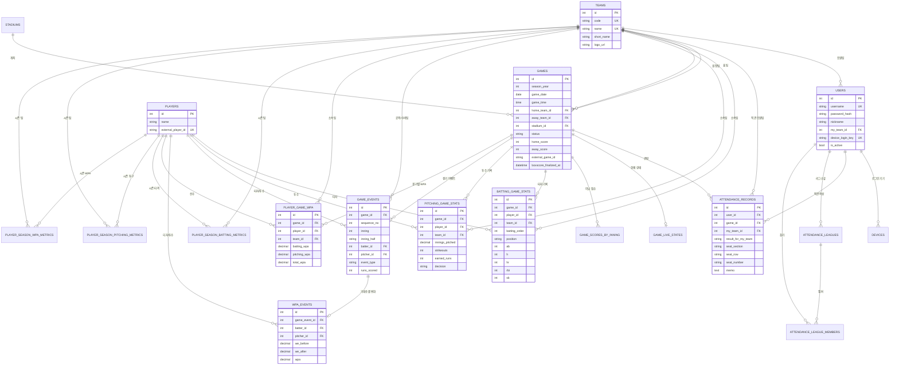

# MY9 데이터베이스 ERD 및 테이블 사용처

> DBMS: PostgreSQL 16
> 마이그레이션: Alembic
> 현행 head: `b63df91e2847`

## 1. 전체 ERD

가독성을 위해 `created_at`, `updated_at`과 일부 세부 지표 컬럼은 ERD에서 생략했다.
정확한 컬럼은 아래 테이블 설명과 SQLAlchemy 모델을 기준으로 한다.

## 2. 계정과 커뮤니티

### `users`

- 용도: 인증 주체, 닉네임, 기본 응원팀
- 주요 키:
  - `username`: 로그인 ID, unique
  - `password_hash`: 해시된 비밀번호
  - `my_team_id`: 홈·직관·구단 테마의 기본 팀
- 사용처:
  - `/v1/auth/register`, `/login`, `/me`
  - 모든 직관/직관 리그 인증
  - 앱 홈의 응원팀 선택

### `devices`

- 용도: 사용자별 앱 기기, 플랫폼, FCM 토큰, 앱 버전
- 현행 사용: 스키마 준비 상태
- 향후 사용: 경기 시작, 우천, 직관 리그 알림

### `attendance_leagues`

- 용도: 직관 대결 그룹
- `owner_id`: 생성자
- `invite_code`: 참가 코드, unique
- 사용처: 리그 생성, 목록, 초대 참가, 상세 조회

### `attendance_league_members`

- 용도: 리그와 사용자의 N:M 연결
- unique: `(league_id, user_id)`
- `role`: `owner` 또는 `member`
- 리그 삭제 시 멤버 행은 cascade 삭제

## 3. 기준 정보

### `teams`

- 용도: KBO 구단 마스터
- `code`: 내부/수집 매핑 코드, unique
- 모든 경기, 선수 경기 기록, 시즌 기록, 응원팀의 기준

### `stadiums`

- 용도: 구장명, 주소, 도시, 좌표
- 일정 수집 시 구장명이 없으면 자동 생성
- 직관 구장별 승률, 경기 상세, 오늘 응원팀 경기의 날씨 조회 위치로 사용
- 좌표가 아직 적재되지 않은 KBO 구장은 API의 구장명-좌표 매핑을 임시 fallback으로 사용
- 날씨 응답은 외부 API에서 조회해 20분 메모리 캐시하며 DB에는 저장하지 않는다.

### `players`

- 용도: 선수 마스터
- `external_player_id`: 외부 소스와 선수를 안정적으로 연결
- 타자/투수 경기 기록, 경기 이벤트, WPA, 시즌 집계의 중심 키

## 4. 경기

### `games`

- 용도: 일정, 진행 상태, 최종 결과의 원본
- unique: `(external_source, external_game_id)`
- 상태:
  - `scheduled`
  - `in_progress`
  - `completed`
  - `cancelled`
- `boxscore_finalized_at`:
  - 완료 박스스코어 저장 시각
  - null인 완료 경기는 재수집 대상
- 사용처:
  - 일정 달력
  - 홈 최근 5경기/다음 경기
  - 구단 순위
  - 직관 기록과 승요
  - 모든 경기 기록의 상위 엔터티

### `game_live_states`

- 용도: 한 경기의 최신 이닝, 초/말, 아웃, 주자 상태, 설명
- `game_id` unique이므로 경기당 1행
- 10초 실시간 폴링 결과를 upsert

### `game_scores_by_inning`

- 용도: 이닝별 홈/원정 점수
- 현행 모델/API 구조는 준비되어 있으나 워커의 기본 일정 수집은 총점 중심

## 5. 직관

### `attendance_records`

- 용도: 사용자가 실제로 관람한 경기와 좌석/메모
- `my_team_id`가 null이면 중립 관람
- `result_for_my_team`은 생성 시 저장하며 조회 시 경기 결과로 보완 계산
- `rating`은 레거시 컬럼으로 DB에는 남아 있지만 앱 입력/표시에서는 제거
- 사용처:
  - 직관 목록/상세/수정/삭제
  - 전체 승요
  - 요일별·구장별 승률
  - 직관 경기 타자/투수 TOP 3
  - 직관 경기 결승타 순위

## 6. 경기별 선수 기록

### `batting_game_stats`

- 용도: 경기 한 건의 선수 타격 기록
- 타순과 포지션이 같아도 교체 선수를 보존할 수 있도록 선수별 행 저장
- 주요 지표:
  - `ab`, `r`, `h`, `doubles`, `triples`, `hr`, `rbi`
  - `bb`, `hbp`, `sf`, `so`, `sb`
  - `avg_after_game`
- 사용처:
  - 경기 선수 기록
  - 직관 TOP 3
  - 팀 타율/안타/홈런
  - 시즌 타자 집계

### `pitching_game_stats`

- 용도: 경기 한 건의 선수 투구 기록
- 주요 지표:
  - `innings_pitched`, `hits`, `home_runs`, `batters_faced`
  - `runs`, `earned_runs`, `walks`, `strikeouts`, `pitches`
  - `decision`, `era_after_game`
- 사용처:
  - 경기 선수 기록
  - 직관 투수 TOP 3와 승수
  - 팀 ERA/WHIP/탈삼진
  - 시즌 투수 집계

## 7. 시즌 집계

### `player_season_batting_metrics`

- unique: `(season_year, player_id, team_id)`
- 경기별 타격 기록을 합산한 조회 전용 집계
- AVG/OBP/SLG/OPS, 추정 wOBA/wRC/wRC+, 안타/도루 등의 정렬에 사용
- `qualification_pa`, `is_qualified`로 규정 타석 구분

### `player_season_pitching_metrics`

- unique: `(season_year, player_id, team_id)`
- ERA/WHIP/K9/BB9/KBB/FIP/K-BB% 계산 결과
- `qualification_innings`, `is_qualified`로 규정 이닝 구분

### `player_season_wpa_metrics`

- unique: `(season_year, player_id, team_id)`
- `player_game_wpa`를 시즌 단위로 합산
- 시즌 기록 화면의 타격/투구/합계 WPA에 사용

## 8. WPA

### `game_events`

- 용도: 타석/주루 등 경기 이벤트의 전후 상태
- 상태 필드:
  - 이닝/초말
  - 아웃 전후
  - 루상 전후(`000`~`111`)
  - 점수 차 전후
  - 득점 수
- 사용처:
  - 결승타 판정
  - 이벤트별 WPA 계산의 입력

### `win_expectancy_table`

- 용도: 시즌, 이닝, 초말, 아웃, 루상, 점수 차에 따른 기대승률 기준표
- 현행 데이터 공급원이 해당 상태값을 제공할 때 WPA 계산에서 조회

### `wpa_events`

- `game_event_id` unique
- 이벤트 전 기대승률, 이벤트 후 기대승률, 차이(WPA)
- 경기 WPA 흐름 그래프 API의 원본

### `player_game_wpa`

- 용도: 이벤트 WPA를 선수·경기 단위로 합산
- 타격 WPA, 투구 WPA, 합계 WPA 저장
- 경기별 선수 기여도와 시즌 WPA 집계의 원본

## 9. 동기화 지원

### `sync_jobs`

- 용도: 시즌 지표 집계 및 시즌 전체 백필 실행 이력
- `job_type`: 예 `season_metrics:2026`
- `job_type`: 전체 백필 성공 시 예 `season_backfill:2026`
- `target_date`: 집계에 반영된 최종 경기일
- API가 시즌 기록의 `as_of_date`를 표시하고, 워커가 다음 시작 날짜를 결정할 때 사용

### `source_mappings`

- 용도: 외부 소스 ID와 내부 엔터티 ID의 일반 매핑
- unique: `(source, source_type, external_id)`
- 현행 KBO 핵심 경로는 팀 코드와 `external_player_id`를 직접 사용하며,
  이 테이블은 다른 데이터 공급원 추가 시 확장 지점

## 10. 삭제 및 데이터 보존 주의

- 대부분의 경기/선수 FK에는 자동 cascade가 없다.
- 운영에서 경기나 선수를 직접 삭제하려면 하위 기록을 먼저 확인해야 한다.
- 직관 리그 멤버만 `league_id` 삭제 cascade가 설정되어 있다.
- 시즌 집계는 원본 경기 기록으로 재생성되므로 직접 수정하지 않는 것이 원칙이다.
- `games.boxscore_finalized_at`을 null로 바꾸면 워커가 해당 완료 경기의 박스스코어를 다시 수집할 수 있다.

## 11. 시즌별 데이터 누적 정책

### 원본 보존

- `games.season_year`가 경기·타자·투수·이벤트·WPA 원본이 속한 시즌의 기준이다.
- 새 시즌 시작 시 과거 `games`, 경기별 기록, 이벤트를 삭제하거나 덮어쓰지 않는다.
- 외부 경기 키는 `(external_source, external_game_id)`로 전체 시즌에서 유일해야 한다.
- 일정·박스스코어 재수집은 해당 경기 행을 upsert하고, 다른 시즌 행에는 영향을 주지 않는다.

### 집계 격리

- 선수 시즌 집계 3종은 모두 `(season_year, player_id, team_id)` 복합 유니크 키를 유지한다.
- 집계 재생성의 삭제·삽입 범위는 반드시 요청한 `season_year`로 제한한다.
- 트레이드 선수는 같은 시즌이라도 팀별 행으로 분리하고, 필요 시 API에서 선수 전체 합계를 별도 합산한다.
- 팀 순위와 규정 타석·규정 이닝은 해당 시즌의 완료 경기만 사용한다.

### 시즌 전환

1. 워커가 현재 연도의 일정 존재 여부를 확인한다.
2. 새 연도 첫 일정이 확인되면 그 연도의 `season_backfill:{연도}` 작업을 시작한다.
3. 새 시즌 경기 기록이 갱신될 때마다 새 시즌 집계만 재생성한다.
4. 과거 시즌 정정은 명시적인 `backfill_history --season-year` 실행으로만 수행한다.
5. API는 `season_year` 쿼리가 없으면 최신 경기 시즌을, 있으면 지정 시즌을 조회한다.

### 장기 운영 인덱스·보관

- 현행 `games(season_year)`와 각 시즌 집계의 `season_year` 인덱스를 유지한다.
- 데이터량이 충분히 커지면 `games`, 경기별 선수 기록, 이벤트 테이블을 시즌 기준 파티셔닝하는
  마이그레이션을 검토하되, 초기 운영에서는 단일 테이블과 인덱스로 유지한다.
- 원본은 영구 보존하고 재생성 가능한 시즌 집계만 필요 시 다시 만든다.
- 백업·복구 검증은 시즌 단위 행 수와 완료 경기 수를 대조한다.

## 12. 문서 동기화 규칙

- 테이블·컬럼·FK·unique·인덱스·마이그레이션 변경 시 이 문서의 ERD와 사용처를 같은 커밋에서 수정한다.
- 데이터가 DB에 저장되지 않는 외부 조회·캐시도 관련 테이블 사용처에 “비영속 데이터”로 기록한다.
- 수집·집계·API 응답 로직 변경은 `CURRENT_LOGIC_AND_FEATURES.md`도 같은 커밋에서 수정한다.
