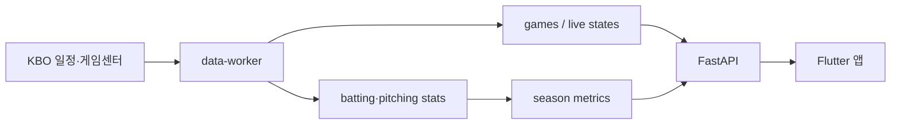

# MY9

직관을 기록하고, 응원팀의 경기 흐름과 선수 기록을 함께 즐기는 KBO 야구 팬 앱입니다.

MY9은 경기 일정·결과, 나의 직관 승률, 시즌 세이버메트릭스, 구단 순위와 WPA 분석을
하나의 야구장 콘셉트 UI로 제공합니다.

> Current baseline: `v1.1` / developing: `v1.2.0`

## 주요 기능

- KBO 월별 일정, 실시간 경기 상태와 최종 결과
- 응원팀 순위, 최근 5경기와 다음 경기
- 오늘 경기 구장 날씨와 계절별 홈 배경
- 직관 경기·좌석·메모 기록과 나의 승·무·패
- 직관 경기 기준 누계형 타자/투수 TOP 5, 결승타 순위와 상대 구단별 승률
- 타자 AVG·OBP·SLG·OPS·안타·도루·추정 wRC+
- 투수 이닝·승수·ERA·WHIP·K/9·피안타율
- 구단 순위 및 팀 타율·홈런·ERA 등 상세 지표
- 경기별 타자/투수 기록과 선수 교체·포지션 이동 흐름
- 경기 일정의 홈팀 기준 예매 바로가기
- 구단별 메인 아이콘과 두산 철웅이/망곰 빌드별 섹션 테마
- 직관 리그 생성 및 초대 코드 참가

## 구성

```text
my9/
├─ mobile-app/       Flutter Android 앱
├─ api-server/       FastAPI REST API와 Alembic 마이그레이션
├─ data-worker/      KBO 일정·결과·박스스코어 수집 워커
├─ wpa-engine/       WPA 계산 확장 모듈
├─ database/         초기 DB 자료
├─ infra/            배포·운영 설정
├─ admin-tool/       관리자 도구
└─ docs/             설계 문서
```

앱, API와 워커는 배포 단위는 다르지만 스키마와 기능 변경을 함께 추적하기 위해 모노레포로 관리합니다.

## 기술 스택

- App: Flutter, Riverpod, Dio, GoRouter
- API: Python 3.12, FastAPI, SQLAlchemy, Alembic
- Worker: APScheduler, Selenium/Chromium, BeautifulSoup
- Data: PostgreSQL 16, Redis 7
- Infra: Docker Compose, AWS ECR 배포 스크립트

## 빠른 시작

### 1. 환경변수

PowerShell:

```powershell
Copy-Item .env.example .env
```

Linux/macOS:

```bash
cp .env.example .env
```

`.env`의 `SECRET_KEY`, DB 비밀번호와 데이터 소스 설정을 실행 환경에 맞게 변경합니다.
실제 KBO 수집은 다음 값이 필요합니다.

```dotenv
DATA_SOURCE_MODE=kbo
CHROME_BINARY=/usr/bin/chromium
CHROME_HEADLESS=true
```

### 2. API와 워커

```bash
docker compose up -d --build
docker compose ps
```

- API: `http://localhost:8000`
- Swagger: `http://localhost:8000/docs`
- Health: `http://localhost:8000/health`

API 컨테이너가 시작될 때 `alembic upgrade head`가 자동 실행됩니다.

### 3. Flutter 앱

```bash
cd mobile-app
flutter pub get
flutter run --dart-define=API_BASE_URL=http://127.0.0.1:8000
```

Android 에뮬레이터에서 호스트 API에 접근할 때는 `127.0.0.1` 대신 `10.0.2.2`를 사용합니다.

## Debug APK 빌드

Windows에서 Wi-Fi용 1개와 외부 접속용 2개를 한 번에 빌드할 수 있습니다.

```bat
cd mobile-app
build-debug-apks.bat
```

실제 주소는 Git에서 제외되는 루트 `.env`에 기록합니다.

```dotenv
MY9_LOCAL_API_URL=http://LOCAL_API_HOST:8000
MY9_EXTERNAL_API_URL=https://PUBLIC_API_HOST
```

배치는 루트 `.env`를 자동으로 읽습니다. 주소를 인자로 직접 덮어쓸 수도 있습니다.

```bat
build-debug-apks.bat http://LOCAL_API_HOST:8000 https://PUBLIC_API_HOST
```

APK는 `mobile-app/build/app/outputs/flutter-apk/`에 생성되며 Git에는 포함되지 않습니다.

- `MY9-local-debug.apk`: Wi-Fi/로컬 API, 두산 철웅이 섹션 아이콘
- `MY9-external-cheolwoong-debug.apk`: 외부 API, 두산 철웅이 섹션 아이콘
- `MY9-external-mangom-debug.apk`: 외부 API, 두산 망곰 섹션 아이콘

두산 섹션 아이콘은 런타임 토글 없이 `DOOSAN_SECTION_THEME=cheolwoong|mangom` 빌드 플래그로 고정합니다.

## 데이터 동기화



- 최초 실행은 3월 1일부터 현재 시즌 전체를 upsert합니다.
- 성공 이력 이후에는 최근 30일과 DB의 가장 이른 미완료 경기부터 재개합니다.
- 경기 상태 또는 점수가 수정되면 박스스코어 확정을 해제하고 다시 수집·집계합니다.
- 경기 시간대의 실시간 점수·이닝·진행 상태는 KBO 게임센터에서 10초 간격으로 확인합니다.
- KBO HTML 구조 변경 시 수집 셀렉터 보정이 필요할 수 있습니다.

## 테스트

```bash
# API
cd api-server
pytest

# Worker
cd data-worker
pytest

# Flutter
cd mobile-app
flutter analyze
flutter test
```

Flutter 반응형 검증에는 320×568부터 600×960까지의 화면과 확대 글꼴 테스트가 포함됩니다.

## 배포

AWS CLI와 Docker 로그인이 준비된 환경에서 ECR로 API/워커 이미지를 올릴 수 있습니다.

```bat
set AWS_ACCOUNT_ID=123456789012
set AWS_REGION=ap-northeast-2
deploy-images-ecr.bat v0.1.0
```

운영 환경에서는 공인 IP 직접 연결 대신 HTTPS 도메인과 ALB, Nginx 또는 Caddy 사용을 권장합니다.

## 문서

- [현행 로직 및 기능](CURRENT_LOGIC_AND_FEATURES.md)
- [DB ERD 및 테이블 사용처](DATABASE_ERD_AND_USAGE.md)
- [기존 기능 명세](MY9_FEATURES.md)
- [설계 문서](docs/)

## 버전 정책

- 제품 릴리스: Git 태그 `vMAJOR.MINOR.PATCH`
- Flutter: `MAJOR.MINOR.PATCH+BUILD`
- API/Worker: 각 `pyproject.toml` 버전
- DB: Alembic revision

현재 최초 공식 릴리스 계열은 앱 `0.1.0+2`, API/Worker `0.1.0`, Git 태그 `v0.1.0`입니다.

## 변경 체크리스트

- DB 모델·Alembic을 바꾸면 `DATABASE_ERD_AND_USAGE.md`의 ERD/사용처도 같은 커밋에서 수정
- 수집·집계·API·앱 로직을 바꾸면 `CURRENT_LOGIC_AND_FEATURES.md`도 같은 커밋에서 수정
- 앱/API/Worker 버전을 바꾸면 README와 현행 로직 문서의 기준 버전도 함께 수정
- 실제 서버 주소와 비밀값은 `.env`에만 두고 Git에 포함하지 않음

## 주의

- `.env`, 키스토어, APK, 빌드 캐시는 커밋하지 않습니다.
- 외부 데이터의 이용약관·저작권·호출 정책을 확인해야 합니다.
- WPA는 신뢰 가능한 이벤트 전후 상태가 있는 경우에만 계산하며 임의 이벤트를 만들지 않습니다.
